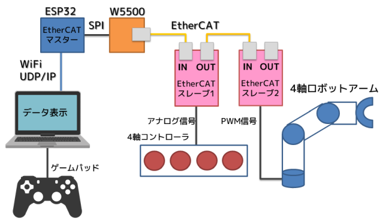

# ESP32でEtherCAT-WiFiゲートウェイ

ESP32 + W5500でEtherCATマスターを動作させつつ、WiFiでUDP/IP通信をするデモ。

## 概要

ESP32でEtherCATマスター(SOEM)を動作させます。ESP32とW5500をSPI接続し、W5500のLANポートでEtherCATの通信をしつつ、ESP32のWiFiでUDP/IP通信をします。

## ESP32とW5500の接続

| ESP32-DevKitC | WIZ850io (W5500) |
| ---- | ---- |
| GND  | GND  |
| 3V3  | 3.3V |
| IO23 (VSPI MOSI) | MOSI |
| IO19 (VSPI MISO) | MISO |
| IO18 (VSPI SCK)  | SCLK |
| IO5  (VSPI SS)   | SCSn |  

<!--
## 動画

-->

## EtherCATによるロボットアーム制御
このプロジェクトは下記のプロジェクトをベースにしています。EtherCATとロボットアーム制御に関してはこちらを参照してください。

- [ArduinoでEtherCATのデモ](https://github.com/lipoyang/Arduino_de_EtherCAT)

## ファイル構成
- `WinEtherCAT/` : Windows用モニタ/コントロールアプリ
- `ESP32_EtherCAT_WiFi/` : ESP32のソース (Arduinoベース)
	- `ESP32_EtherCAT_WiFi.ino` : スケッチ本体
	- `ethercat.cpp` : EtherCAT通信処理とロボットアーム制御
	- `udpip.cpp` : UDP/IP通信処理

## 依存ライブラリ
- [lipoyang /SOEM4Arduino](https://github.com/lipoyang/SOEM4Arduino)

